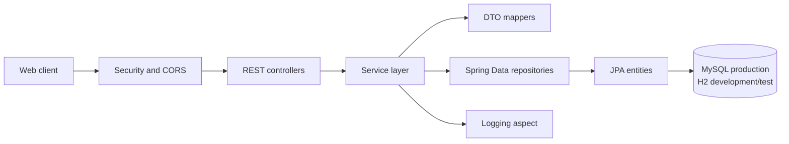
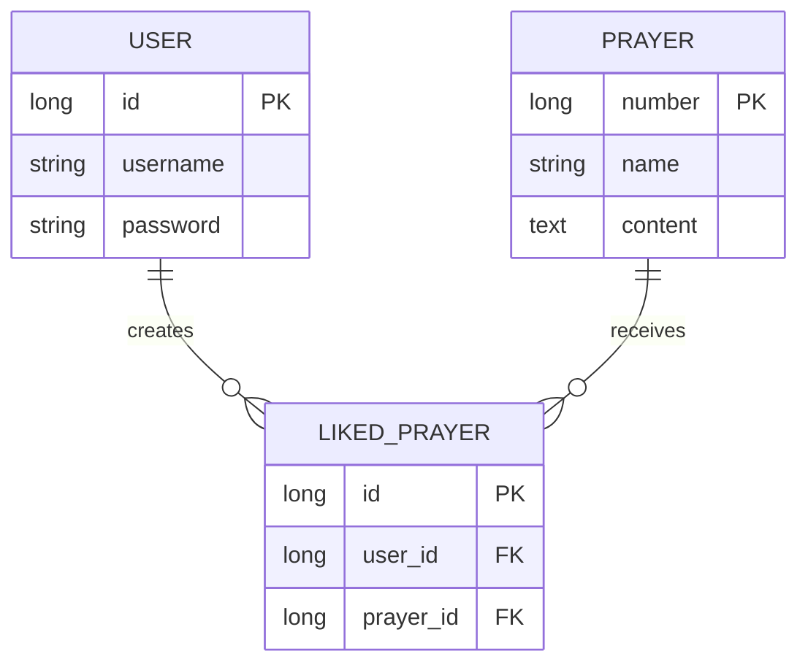

# Prayer Book API

Java Spring Boot REST API for a prayer book application. The API manages users,
prayers, and prayer likes, and is deployable to Railway or another platform that
provides a Java runtime and MySQL database.

## Technology Stack

- Java 17 source compatibility
- Spring Boot 4.1.0
- Spring Web MVC for REST endpoints
- Spring Data JPA and Hibernate for persistence
- MySQL for production and H2 for the development/test profile
- Spring Security, BCrypt password hashing, and CORS configuration
- Maven Wrapper for builds and tests
- Lombok for entity and DTO boilerplate

## Project Architecture

The application follows a layered architecture. Requests enter through REST
controllers, business operations are handled by services, and repositories
provide the persistence boundary. DTOs prevent API contracts from depending
directly on most entity details.



### Package Responsibilities

| Package | Responsibility |
| --- | --- |
| `controller` | HTTP routes, request validation, status codes, and response bodies |
| `Service` | User, prayer, and like business operations |
| `Repo` | Spring Data JPA repositories and database queries |
| `utility` | JPA entities such as `User`, `Prayer`, and `LikedPrayer` |
| `dto` | Request and response models exposed by the API |
| `mapper` | Conversion between entities and DTOs |
| `config` | Spring Security, password encoding, and CORS configuration |
| `aop` | Logging around service-layer calls |

### Data Model



## API Reference

All endpoints are currently exposed without authentication. JSON request and
response bodies are used unless otherwise noted.

### Prayers

| Method | Path | Description |
| --- | --- | --- |
| `POST` | `/prayer` | Create a prayer |
| `GET` | `/prayer` | Return all prayers as DTOs |
| `GET` | `/prayer/{id}` | Return one prayer |
| `GET` | `/prayer/names` | Return only the names of all prayers |
| `GET` | `/prayerList?page=0&size=10` | Return a paginated list of prayers |
| `PUT` | `/prayer/{id}` | Update a prayer |
| `DELETE` | `/prayer/{id}` | Delete a prayer |

Example response from `GET /prayer/names`:

```json
["Morning Prayer", "Evening Prayer"]
```

### Users

| Method | Path | Description |
| --- | --- | --- |
| `POST` | `/user` | Create a user |
| `GET` | `/user` | Return all users |
| `GET` | `/user/{id}` | Return one user |
| `PUT` | `/user/{id}` | Update a user |
| `DELETE` | `/user/{id}` | Delete a user |
| `POST` | `/login` | Authenticate a user |

### Likes

| Method | Path | Description |
| --- | --- | --- |
| `POST` | `/liked/{userId}/{prayerId}` | Like a prayer |
| `DELETE` | `/liked/{userId}/{prayerId}` | Remove a like |
| `GET` | `/liked/{userId}` | Return prayer IDs liked by a user |
| `GET` | `/liked/top-liked` | Return the most-liked prayers |

## Running Locally

### Prerequisites

- JDK 17 or later
- MySQL for the default production profile, or use the development profile with H2
- A database named `Prayer` when using MySQL

From the `demo` directory:

```bash
./mvnw spring-boot:run
```

The API starts on `http://localhost:8080` by default. To use the development
profile with the embedded H2 database:

```bash
./mvnw spring-boot:run -Dspring-boot.run.profiles=dev
```

Build the project:

```bash
./mvnw clean package
```

Run tests:

```bash
./mvnw test
```

## Configuration

Configuration is stored in `demo/src/main/resources`:

- `application.properties` selects the active profile and defines shared defaults.
- `application-dev.properties` uses an in-memory H2 database and verbose logging.
- `application-prod.properties` uses MySQL and environment variables.

Production database settings can be supplied with:

```bash
export DB_URL='jdbc:mysql://localhost:3306/Prayer?useSSL=false&allowPublicKeyRetrieval=true&serverTimezone=UTC'
export DB_USERNAME='root'
export DB_PASSWORD='your-password'
export PORT=8080
```

The application also allows the configured local development origins and the
deployed frontend origin `https://prayer-frontend-eight.vercel.app` through CORS.

## Deployment

The repository contains the Maven project under `demo`, so a deployment service
should use `demo` as the working directory and run:

```bash
./mvnw spring-boot:run
```

For a packaged deployment, build with `./mvnw clean package` and run the generated
JAR from `demo/target`. Set `DB_URL`, `DB_USERNAME`, `DB_PASSWORD`, and `PORT` in
the deployment environment rather than committing credentials.

## Repository Layout

```text
Praybook/
├── README.md
└── demo/
	├── pom.xml
	├── mvnw
	└── src/
		├── main/java/com/prayer/demo/
		│   ├── aop/
		│   ├── config/
		│   ├── controller/
		│   ├── dto/
		│   ├── mapper/
		│   ├── Repo/
		│   ├── Service/
		│   └── utility/
		└── test/java/com/prayer/demo/
```

## Security Notes

Passwords are encoded with BCrypt before persistence. CSRF is disabled because
the application exposes a stateless REST API, and all requests are currently
permitted by `SecurityConfig`; authentication and authorization should be added
before exposing administrative or user-specific operations publicly.
